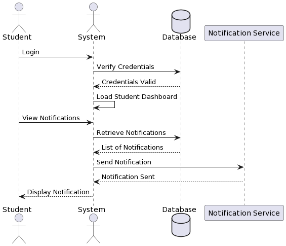
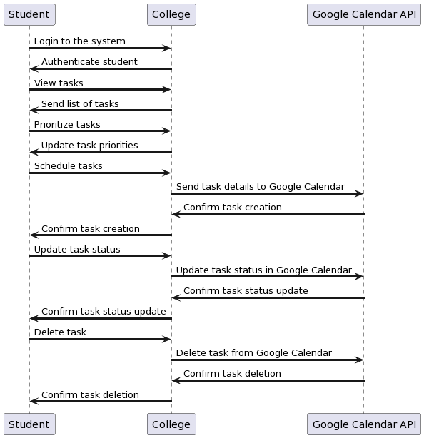
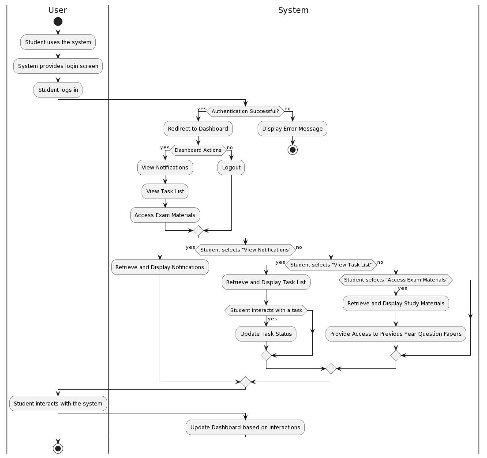
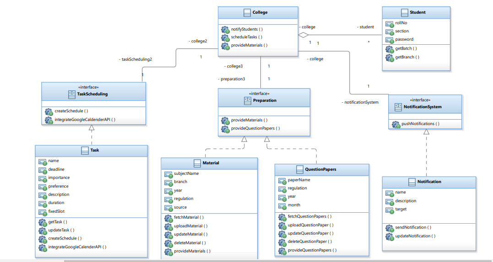
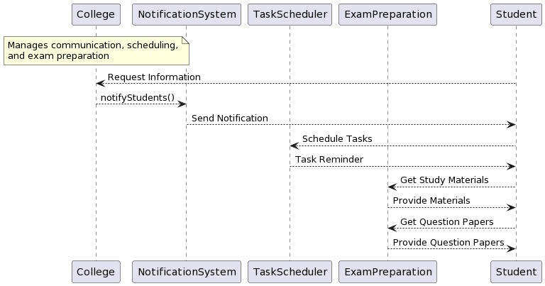
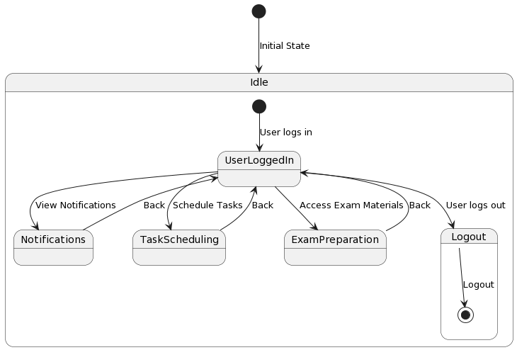

# UML Diagrams

This repository contains UML diagrams represented as images.

## Sequence Diagram 1

## Sequence Diagram 2

## Sequence Diagram 3

## Activity Diagram

## Class Diagram

## Collaboration Diagram

## Component Diagram

## Deployment Diagram

## StateChart Diagram

