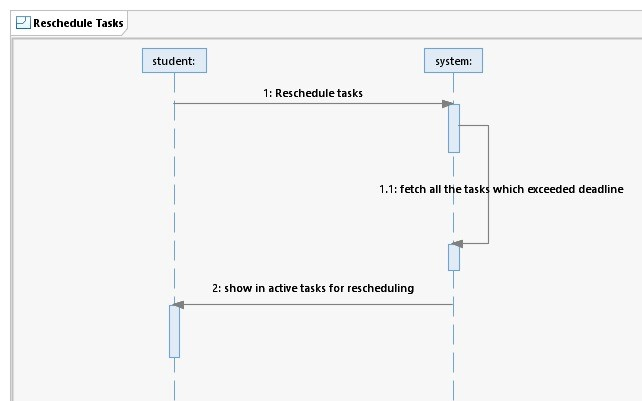

# UML Diagrams

This repository contains UML diagrams represented as images.

## Usecase Diagram

## Class Diagram

## Sequence Diagram Registration

## Sequence Login Diagram

## Sequence Diagram Add Task

## Sequence Diagram Manage Tasks

## Sequence Diagram Reschedule Tasks

## Collaboration Diagram

## Component Diagram

## Deployment Diagram

